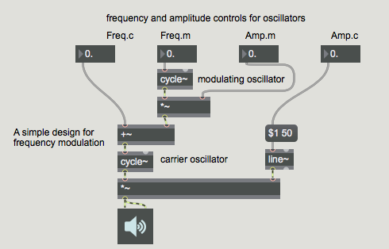
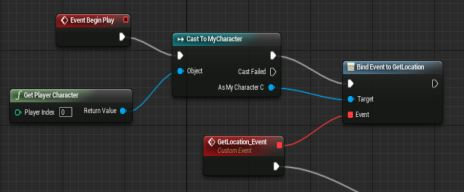
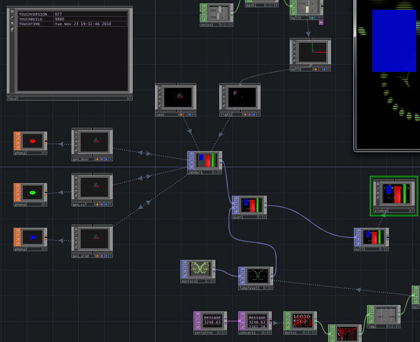

# cfgr
[](https://travis-ci.org/markkorput/pycfgr)


## What is it?

pycfgr is part of a cross-language exploration in search of new ways to create software systems.

Other repositories that perform similar (but not -yet- compatible) research;
* [JavaLibUiBuilder (Java)](https://github.com/fusefactory/JavaLibUiBuilder)
* [py2030 (python)](https://github.com/markkorput/py2030)
* [ciCMS (C++/Cinder)](https://github.com/markkorput/cicms)
* [ciInfo (C++/Cinder)](https://github.com/markkorput/ciinfo)

Cfgr provides a set of APIs that encourage separation of configuration from logic. It helps organising the application logic in small, modular components and lets you put those together through configuration (json) files to create complex systems. 

The approach borrows concepts from Visual Programming Languages (VPLs) which generally let you create instances of pre-built building blocks and connect them together to perform complex tasks. These concepts are translated back into a text-based workflow.

[](docs/vpl-02-maxmsp.png)
[](docs/vpl-01-blueprints.jpg)
[](docs/vpl-03-touchdesigner.png)

_three famous examples of VPLs (from left to right); [Cyling '74's Max](https://cycling74.com/products/max/), [Unreal Engine's Blueprints](https://docs.unrealengine.com/en-US/Engine/Blueprints/index.html) and [Derivative's TouchDesigner](http://derivative.ca)_

Why?
* A text-based workflow using standard formats (like JSON) allows for the most flexible/customizable development pipelines and benefit of massive set of available tools (version control systems, text-editors, IDEs, command-line, ssh, etc.).
* Separating configuration from the logic provides possiblity to make and actuate changes (from minor properties to major application structures) at runtime.
* Removing configuraion (as much as possible) from you application code keeps the code clear and concise.
* Enforcing a modular component structure encourages best practices like the single responsibility principle and writing modular code that is truly reusable.

### Some history

Motivation for this exploration came from many years of experience in professional software development, specifically non web-based UI software development in C++ and Java using frameworks like OpenFrameworks, Cinder and Processing and noticing patterns of repetition, both in code and in general workflow. This experience lead to, initially, the [JavaLibUiBuilder](https://github.com/fusefactory/JavaLibUiBuilder) which builds on top of a UI framework ([JavaLibUi](https://github.com/fusefactory/JavaLibUi), inspired by the [ofxInterface](https://github.com/galsasson/ofxInterface) library for OpenFrameworks/C++), which started the concept of building and configuring application logic from json config files (which feels a bit like writing CSS from a web-page).

This concept was translated into C++ using in the [ciCMS](https://github.com/markkorput/cicms) package for the [Cinder](https://libcinder.org/) framework and extended to provide "native" events and states to further reduce the amount of custom application code needs to be written to make the different components communicate.

## Examples

### Hello World

Below is an example of what an Hello World implementation could look like. Obviously this level of abstraction doesn't make much sense in a HelloWorld scenario, but it demonstrates the concepts of configuration, logic, components and events.

_cfgr.json (config)_
```json
{
  "App": {"started":"#appstarted", "stop":"#stopapp"},
  "App.String": {"value": "Hello World!", "in-emit":"#appstarted", "out-emit":"#sayhello,#stopapp"},
  "App.Print": {"on": "#sayhello"}
}
```

_components/string.py (component logic)_
```python
from evento import Event

class String:
  """
  A simple string-value component
  """

  def __init__(self):
    self.value = None
    self.emitEvent = Event()
    

  def setValue(self, v):
    self.value = v

  def emit(self):
    self.emitEvent(self.value)

  @staticmethod
  def cfgr(builder):
    ## outputs
    builder.addInput('value').string(lambda val,obj: obj.setValue(val))
    builder.addInput('emit').connect_to_method(lambda obj: obj.emit)

    ## outputs
    # builder.addOutput('emit').connect(lambda port, obj: obj.emitEvent.subscribe(port.event.fire()))
    builder.addOutput('emit').connect_to_event(lambda obj: obj.emitEvent)
```

_components/print.py (component logic)_
```python
from evento import Event

class Print:
  """
  A simple text-printing component
  """
  def print(self, v):
    print(v)

  @staticmethod
  def cfgr(builder):
    ## outputs
    builder.addInput('on').string_to_method(lambda val,obj: obj.print)
```

```bash
python -m cfgr.app cfgr.json # uses the default cfgr.app runner
```